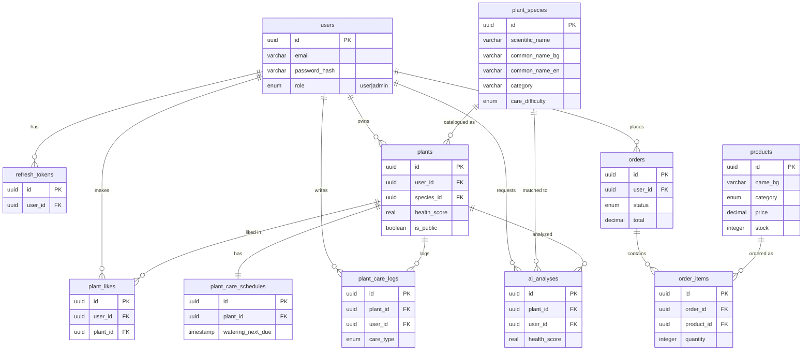

# 🌹 Scarlet — Flower Shop & Plant Health Tracker

Scarlet is a multi-platform full-stack application built for the SoftUni
**“Full Stack Apps with AI”** capstone. It combines a boutique **flower shop**
with a personal **plant collection tracker** that uses AI for plant health
analysis and species identification. The app is fully bilingual — **Bulgarian
(default) and English**.

| | |
|---|---|
| **Web (live)** | _… add Netlify URL_ |
| **Mobile (live)** | _… add Expo web export URL_ |
| **Repo** | https://github.com/JoyIsInMotion/scarlet-plant-shop-health |
| **Test login** | `demo@scarlet.com` / `demo123` (user) · `admin@scarlet.com` / `admin123` (admin) |

---

## What it does

Two domains in one app:

1. **Flower shop** — browse a product catalog (categories, search, pricing),
   add items to a cart, and place orders with order history.
2. **Plant tracker** — keep a personal plant collection with photos and health
   scores, run **AI health analysis / species ID** (rate-limited to 5/day),
   track care schedules & logs, and browse a public species catalog of ~470
   species with bilingual care guides. A community feed lets users share plants
   publicly and like others’.

### Roles

- **Visitor** — home, flower catalog, public species catalog, register/login.
- **User** — manage own plants, run AI scans, shop & order, community feed.
- **Admin** — manage the species catalog (and, in progress, products).

---

## Tech stack

| Layer | Technology |
|-------|-----------|
| Web | Next.js 14 (App Router, Server Components & Actions) · React · TypeScript · Tailwind CSS |
| Mobile | React Native + Expo (Expo Router) — _companion app, in progress_ |
| Backend | Next.js Route Handlers (REST) + a service layer |
| Database | Neon serverless PostgreSQL via `@neondatabase/serverless` (HTTP driver) |
| ORM | Drizzle ORM + Drizzle Kit migrations |
| Auth | Custom JWT (access + refresh), `bcryptjs` password hashing |
| AI | **Groq `llama-4-scout`** (plant health analysis & species ID) |
| Storage | Cloudflare R2 (S3-compatible) for user photos & product images |
| i18n | next-intl (web) — Bulgarian default, English secondary |
| Deployment | Netlify (web) · EAS / Netlify web export (mobile) |

---

## Architecture

Client-server, in a Node.js monorepo:

```
            ┌─────────────────────────────┐
            │      web (Next.js)      │
 Browser ──▶│  Server Components/Actions   │──▶ Drizzle ──▶ Neon PostgreSQL
            │  Route Handlers (REST API)   │──▶ Cloudflare R2 (photos)
            └──────────────┬──────────────┘──▶ Groq API (AI analysis)
                           │ REST + JWT Bearer
            ┌──────────────▼──────────────┐
            │   mobile (Expo) [WIP]   │
            └─────────────────────────────┘
```

- **Web → Backend:** Server Actions (mutations) + Server Components (data fetch),
  calling the **service layer** in `web/src/services/*`.
- **Mobile → Backend:** the same logic is exposed as a **RESTful API** under
  `web/src/app/api/*`, authenticated with a JWT Bearer token.
- **Auth:** access token (short-lived) + refresh token. Web stores them in
  httpOnly cookies; mobile uses `expo-secure-store` + `Authorization` header.
- **Business logic** lives in services so both Server Actions and the REST API
  share one implementation.

---

## Database schema

11 tables (UUID primary keys, foreign keys with cascade/restrict rules,
btree + composite indexes). Defined in
[`web/src/db/schema.ts`](web/src/db/schema.ts); migrations in
[`web/src/drizzle`](web/src/drizzle).



---

## Repo structure

```
scarlet/
├─ web/                        # Next.js — web client + REST API backend
│  ├─ src/app/[locale]/        # localized pages: (auth), (app), catalog, shop, community…
│  ├─ src/app/api/             # REST API route handlers
│  ├─ src/services/            # business logic (catalog, orders, community, …)
│  ├─ src/db/                  # Drizzle schema + seed & data-fetch scripts (tsx)
│  ├─ src/drizzle/             # Drizzle SQL migrations
│  ├─ src/lib/ai/              # Groq plant analyzer + rate limiting
│  ├─ src/lib/r2/              # Cloudflare R2 client
│  └─ messages/                # next-intl translations (bg.json, en.json)
├─ mobile/                     # Expo (React Native) companion app — in progress
├─ shared/                     # shared TypeScript types & Zod validators
├─ AGENTS.md                   # instructions for AI dev agents
└─ web/docs/                   # project status & plan
```

---

## REST API (selected)

All protected routes use the `withAuth` wrapper and a JWT Bearer token.

| Method | Route | Purpose |
|--------|-------|---------|
| POST | `/api/auth/register` · `/login` · `/refresh` · `/logout` | Auth |
| GET | `/api/plants` · `/api/plants/[id]` | User's plants (paged) |
| POST | `/api/plants/[id]/ai-analysis` · `/api/ai/quick-scan` | AI analysis |
| GET | `/api/catalog` · `/api/catalog/[id]` | Species catalog (paged, search, category) |
| GET | `/api/products` · `/api/products/[id]` | Shop products (paged, category) |
| GET | `/api/orders` | User's orders |
| GET/POST | `/api/community/plants` · `/api/community/plants/[id]/like` | Community feed & likes |

---

## Local development

**Prerequisites:** Node.js 20+, a Neon PostgreSQL database, a Cloudflare R2
bucket, and a Groq API key.

```bash
# 1. Clone & install (npm workspaces)
git clone https://github.com/JoyIsInMotion/scarlet-plant-shop-health
cd scarlet-plant-shop-health
npm install

# 2. Configure web/.env.local
#   DATABASE_URL=postgresql://...
#   JWT_ACCESS_SECRET=...        JWT_REFRESH_SECRET=...
#   JWT_ACCESS_EXPIRES_IN=15m    JWT_REFRESH_EXPIRES_IN=7d
#   GROQ_API_KEY=...
#   R2_ACCOUNT_ID=...  R2_ACCESS_KEY_ID=...  R2_SECRET_ACCESS_KEY=...
#   R2_BUCKET_NAME=...  R2_PUBLIC_URL=...
#   NEXT_PUBLIC_APP_URL=http://localhost:3000

# 3. Apply database migrations
npm run db:migrate

# 4. Seed sample data
npm run db:seed

# 5. Run the web app (http://localhost:3000)
npm run dev:web

# 6. Run the mobile app (separate terminal)
npm run dev:mobile
```

### Root scripts

| Script | Does |
|--------|------|
| `npm run dev` | Run web + mobile together |
| `npm run dev:web` / `dev:mobile` | Run one app |
| `npm run build` | Build both apps |
| `npm run db:generate` | Generate a Drizzle migration from schema changes |
| `npm run db:migrate` | Apply migrations |
| `npm run db:seed` | Seed sample data |

> More agent/architecture conventions are documented in [`AGENTS.md`](AGENTS.md).
> Project status and the capstone self-assessment live in
> [`web/docs/performance-plan.md`](web/docs/performance-plan.md).
