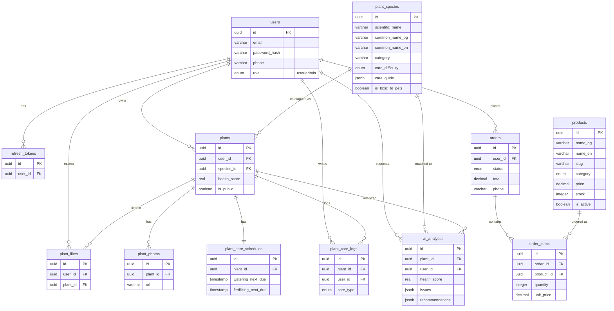

# Scarlet — Flower Shop & Plant Health Tracker

> **Buy plants, then keep them alive.** Scarlet is a boutique online flower &
> plant shop with a built-in AI plant-care assistant. Snap a photo of any plant
> and an AI vision model scores its health, spots problems (pests, over-watering,
> nutrient issues), identifies the species, and tells you exactly how to fix and
> care for it — all in plain Bulgarian or English.

Scarlet is a multi-platform full-stack application
It pairs two things people normally need
two separate apps for: a place to **buy** plants and flowers, and a tool to
**look after** the ones you own. The whole experience is bilingual —
**English (default) and Bulgarian** — and runs on web and as a native Android app.

**Who it's for & what they can do:**

- 🛒 **Shoppers** browse a flower & plant catalog, add to a cart, and place a
  pickup order — no account needed to look around.
- 🪴 **Plant owners** build a personal collection, track each plant's health
  over time, get AI care advice, and never forget a watering with per-plant care
  schedules and logs.
- 📷 **Anyone curious** can point the camera at a plant (even one they don't own)
  for an instant AI health scan and species guess — one free scan a day before
  signing up.
- 🌍 **The community** shares plants publicly and likes each other's — a feed of
  real, thriving (or struggling!) plants.
- 🛠️ **Admins** manage the product catalog (with server-side search & pagination),
  the species encyclopedia, users, and orders from a dedicated admin panel.

| | |
|---|---|
| **Web (live)** | https://scarletflowers.netlify.app |
| **Mobile web build** | https://scarletshop.netlify.app |
| **Repo** | https://github.com/JoyIsInMotion/scarlet-plant-shop-health |
| **Test login** | `demo@scarlet.com` / `demo123` (user) · `admin@scarlet.com` / `admin123` (admin) |

---

## What it does

Two domains in one app:

1. **Flower shop** — browse a product catalog (categories, search, pricing),
   add items to a cart, and place pickup orders (a contact phone is required so
   the shop can call about details; no shipping address, deviery in site only) with full order history.
2. **Plant tracker** — keep a personal plant collection with photos and health
   scores, run **AI health analysis / species ID** (rate-limited to 5/day),
   manage per-plant **care schedules & logs** on a dedicated care page, and
   browse a public species catalog of ~474 species with bilingual care guides.
   A community feed lets users share plants publicly and like others'.

### Roles

- **Visitor** — home, flower catalog, public species catalog, plus **one free AI
  scan per day** before being prompted to sign up; register/login.
- **User** — manage own plants & care logs, run AI scans, shop & order,
  community feed, edit own profile (incl. phone).
- **Admin** — manage the species catalog, **products** (server-side search by
  name or slug, pagination, create/edit/restock/delete) and **users** (role,
  active status, phone, and their orders).

---

## Tech stack

| Layer | Technology |
|-------|-----------|
| Web | Next.js 16 (App Router, Server Components) · React 19 · TypeScript · Tailwind CSS |
| Mobile | React Native + Expo (Expo Router) — native Android APK via EAS Build |
| Backend | Next.js Route Handlers (REST) + a service layer |
| Database | Neon serverless PostgreSQL (US East — Ohio) via `@neondatabase/serverless` (HTTP driver) |
| ORM | Drizzle ORM + Drizzle Kit migrations |
| Auth | Custom JWT (access + refresh), `bcryptjs` password hashing |
| AI | **Groq** — Llama 4 Scout vision (`meta-llama/llama-4-scout-17b-16e-instruct`) for plant health analysis & species ID |
| Storage | Cloudflare R2 (S3-compatible) for user photos & product images |
| i18n | next-intl (web) — English default, Bulgarian secondary |
| Deployment | Netlify (web) · EAS Build (Android APK) · Netlify web export (mobile web) |

---

## Architecture

Client-server, in a Node.js monorepo:

```
            ┌─────────────────────────────┐
            │        web (Next.js)        │
 Browser ──▶│  Server Components/Actions  │──▶ Drizzle ──▶ Neon PostgreSQL (Ohio)
            │  Route Handlers (REST API)  │──▶ Cloudflare R2 (photos)
            └──────────────┬──────────────┘──▶ Groq API (AI analysis)
                           │ REST + JWT Bearer
            ┌──────────────▼──────────────┐
            │      mobile (Expo RN)       │
            │  iOS / Android / Web build  │
            └─────────────────────────────┘
```

- **Web → Backend:** Server Actions (mutations) + Server Components (data fetch),
  calling the **service layer** in `web/src/services/*`.
- **Mobile → Backend:** the same logic is exposed as a **RESTful API** under
  `web/src/app/api/*`, authenticated with a JWT Bearer token.
- **Auth:** access token (short-lived) + refresh token. Web stores them in
  httpOnly cookies; mobile uses `expo-secure-store` + `Authorization` header.
- **Business logic** lives in services so both Server Actions and the REST API
  share one implementation.

---

## Database schema

12 tables (UUID primary keys, foreign keys with cascade/restrict rules,
btree + composite indexes). Defined in
[`web/src/db/schema.ts`](web/src/db/schema.ts); migrations in
[`web/src/drizzle`](web/src/drizzle).



---

## Repo structure

```
scarlet/
├─ web/                        # Next.js — web client + REST API backend
│  ├─ src/app/[locale]/        # localized pages: (auth), (app), catalog, shop, community…
│  ├─ src/app/api/             # REST API route handlers
│  ├─ src/services/            # business logic (catalog, orders, community, …)
│  ├─ src/db/                  # Drizzle schema + seed & maintenance scripts (tsx)
│  ├─ src/drizzle/             # Drizzle SQL migrations
│  ├─ src/lib/ai/              # Groq plant analyzer + rate limiting
│  ├─ src/lib/r2/              # Cloudflare R2 client
│  └─ messages/                # next-intl translations (bg.json, en.json)
├─ mobile/                     # Expo (React Native) companion app
│  ├─ src/app/                 # Expo Router screens
│  ├─ src/components/          # shared UI components
│  ├─ src/lib/                 # API client, auth, storage
│  └─ eas.json                 # EAS Build profiles (preview APK, production)
├─ shared/                     # shared TypeScript types & Zod validators
└─ AGENTS.md                   # instructions for AI dev agents
```

---

## REST API (selected)

All protected routes use the `withAuth` wrapper and a JWT Bearer token.

| Method | Route | Purpose |
|--------|-------|---------|
| POST | `/api/auth/register` · `/login` · `/refresh` · `/logout` | Auth |
| GET | `/api/plants` · `/api/plants/[id]` | User's plants (paged) |
| POST | `/api/plants/[id]/ai-analysis` · `/api/ai/quick-scan` | AI analysis |
| GET | `/api/catalog` · `/api/catalog/[id]` | Species catalog (paged, search, category) |
| GET | `/api/products` · `/api/products/[id]` | Shop products (paged, category, search) |
| GET | `/api/orders` | User's orders |
| GET/POST | `/api/community/plants` · `/api/community/plants/[id]/like` | Community feed & likes |

---

## Testing & CI

Tests live in [`web/tests`](web/tests):

- **`tests/unit`** — Vitest. Covers Zod validators, JWT sign/verify, the
  `withAuth` authorization guard (401/403/200), service ownership & admin
  guardrails, and utilities. Run with `npm test` (in `web/`).
- **`tests/e2e`** — Playwright smoke tests (home + i18n logo, login success/
  failure, add-to-cart toast & cart visibility, admin route guard). Run with
  `npm run test:e2e` against a running dev server (or set `E2E_BASE_URL`).

**GitHub Actions** ([`.github/workflows/ci.yml`](.github/workflows/ci.yml)) runs
lint, typecheck, and unit tests on every push/PR to `main` using Node.js 24.
A separate [backup workflow](.github/workflows/backup.yml) runs daily DB + R2
backups with a retention policy. E2E tests run locally — they need a live database.

---

## Local development

**Prerequisites:** Node.js 20+, a Neon PostgreSQL database, a Cloudflare R2
bucket, and a Groq API key.

```bash
# 1. Clone & install (npm workspaces)
git clone https://github.com/JoyIsInMotion/scarlet-plant-shop-health
cd scarlet-plant-shop-health
npm install

# 2. Configure web/.env.local  (copy from web/.env.example)
#   DATABASE_URL=postgresql://...
#   JWT_ACCESS_SECRET=...        JWT_REFRESH_SECRET=...
#   JWT_ACCESS_EXPIRES_IN=15m    JWT_REFRESH_EXPIRES_IN=7d
#   GROQ_API_KEY=...
#   R2_ACCOUNT_ID=...  R2_ACCESS_KEY_ID=...  R2_SECRET_ACCESS_KEY=...
#   R2_BUCKET_NAME=...  R2_PUBLIC_URL=...
#   PEXELS_API_KEY=...
#   NEXT_PUBLIC_APP_URL=http://localhost:3000

# 3. Apply database migrations
npm run db:migrate --workspace=web

# 4. Seed sample data (1 000 users · 474 species · 10 000 plants · 5 500 products · 1 002 orders)
npm run db:seed --workspace=web

# 5. Run the web app (http://localhost:3000)
npm run dev:web

# 6. Run the mobile app (separate terminal)
npm run dev:mobile
```

### Root scripts

| Script | Does |
|--------|------|
| `npm run dev` | Run web + mobile together |
| `npm run dev:web` / `dev:mobile` | Run one app |
| `npm run build` | Build both apps |
| `npm run db:generate` | Generate a Drizzle migration from schema changes |
| `npm run db:migrate` | Apply migrations (idempotent, tolerates existing objects) |
| `npm run db:seed` | Seed sample data — idempotent, safe to re-run |
| `npm run db:transfer-images` | Copy product/species image URLs between Neon projects (`FRANKFURT_URL` env required) |
| `npm run db:fix-product-descriptions` | Re-apply curated accessory descriptions |
| `npm run db:fix-bg-names` | Capitalize Bulgarian species names |

Tests run from the `web/` workspace: `npm test` (unit) and `npm run test:e2e` (Playwright).

### Android APK (EAS Build)

```bash
cd mobile
eas build --platform android --profile preview   # internal APK
eas build --platform android --profile production # signed release
```

Requires an [Expo](https://expo.dev) account and `eas-cli` installed globally.
The `EXPO_PUBLIC_API_URL` is baked into the build via `eas.json`.

> More agent/architecture conventions are documented in [`AGENTS.md`](AGENTS.md).
